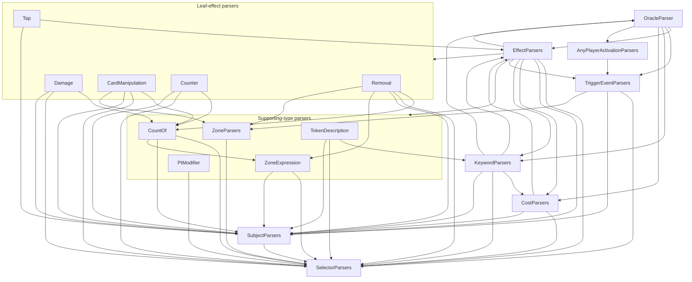

# Oracle parser dependency graph

Cross-class references between the parser files in
`mtg-engine/src/main/java/be/imgn/mtg/engine/oracle/`. Each edge
`A → B` means at least one parser constant in `A` references a parser
constant exported by `B`. Only cross-class edges are shown — intra-class
references are omitted because they'd drown out the diagram.

## High-level picture

## Cycles

The graph is **not** a DAG. The dispatcher has bidirectional edges:

- `OracleParser ⇄ EffectParsers` — `OracleParser` calls `EffectParsers.CLAUSE` / `EFFECT`; `EffectParsers` calls `OracleParser.ABILITY` for quoted abilities inside `GainAbility` effects (resolved via `Parser.Rule`).
- `EffectParsers ⇄ CostParsers` — costs reference `EffectParsers.MANA_SYMBOL`; effects reference `CostParsers.COST_EXPRESSION` for "pay" costs.
- `EffectParsers ⇄ KeywordParsers` — keywords reference `EffectParsers.MANA_SYMBOL`; effects reference `KeywordParsers.KEYWORD_LIST` for "gain <keyword>" tails.
- `EffectParsers ⇄ TapEffectParsers` — TapEffectParsers uses `EffectParsers.WORD_OR_CONTRACTION`; EffectParsers routes through `TAP`/`UNTAP`.

All cycles funnel through `EffectParsers`, so every leaf parser ultimately pays static-init cost on first oracle-text parse.

## Cross-class reference detail

Read `A → B: X, Y` as "`A` references `B.X` and `B.Y`".

### AnyPlayerActivationParsers
- `→ TriggerEventParsers`: `STEP_NAME`

### CardManipulationEffectParsers
- `→ CountOfParsers`: `FOR_EACH`, `PROPERTY_OF_AMOUNT`, `ROUNDING_DIRECTION`, `WHERE_X_IS`
- `→ SelectorParsers`: `AMOUNT`, `SELECTOR`
- `→ SubjectParsers`: `ATOMIC_SUBJECT`, `PLAYER_LIKE_SUBJECT`, `PLAYER_SUBJECTS`, `SUBJECT`
- `→ ZoneParsers`: `ZONE`, `ZONE_SOURCE`

### CostParsers
- `→ EffectParsers`: `MANA_SYMBOL`
- `→ SelectorParsers`: `AMOUNT`, `COUNTER_TYPE`, `INTEGER`, `SELECTOR`, `ZONE_NAME`
- `→ SubjectParsers`: `SUBJECT`

### CountOfParsers
- `→ SelectorParsers`: `AMOUNT`, `COUNTER_TYPE`
- `→ SubjectParsers`: `PLAYER_LIKE_SUBJECT`, `SUBJECT`
- `→ ZoneExpressionParsers`: `IN_ZONE`

### CounterEffectParsers
- `→ CountOfParsers`: `FOR_EACH`, `WHERE_X_IS`
- `→ SelectorParsers`: `AMOUNT`, `COUNTER_TYPE`
- `→ SubjectParsers`: `SUBJECT`

### DamageEffectParsers
- `→ CountOfParsers`: `FOR_EACH`, `PROPERTY_OF_AMOUNT`, `ROUNDING_DIRECTION`
- `→ SelectorParsers`: `AMOUNT`, `CARD_TYPE`
- `→ SubjectParsers`: `PLAYER_SUBJECTS`, `SUBJECT`

### EffectParsers (the hub)
- `→ CardManipulationEffectParsers`: `DISCARD`, `DISCARD_NO_PLAYER`, `DRAW`, `DRAW_NO_PLAYER`, `MILL`, `MILL_NO_PLAYER`, `REVEAL`, `REVEAL_NO_PLAYER`, `SCRY`, `SEARCH`, `SHUFFLE`, `SURVEIL`
- `→ CostParsers`: `COST_EXPRESSION`
- `→ CountOfParsers`: `FOR_EACH`, `PROPERTY_OF_AMOUNT`, `WHERE_X_IS`
- `→ CounterEffectParsers`: `ADD_COUNTERS`, `ADD_COUNTERS_PAIR`, `DISTRIBUTE_COUNTERS`, `REMOVE_ALL_COUNTERS`, `REMOVE_COUNTERS`
- `→ DamageEffectParsers`: `DEAL_DAMAGE`, `DEAL_DIVIDED_DAMAGE`, `GAIN_LIFE`, `GAIN_LIFE_NO_PLAYER`, `LOSE_LIFE`, `LOSE_LIFE_NO_PLAYER`
- `→ KeywordParsers`: `KEYWORD_LIST`
- `→ OracleParser`: `ABILITY`
- `→ PtModifierParsers`: `PT_MODIFIER`
- `→ RemovalEffectParsers`: `BOUNCE`, `DESTROY`, `EXILE`, `EXILE_OBJECT_AND_ZONE`, `SACRIFICE_WITH_SCALE`
- `→ SelectorParsers`: `AMOUNT`, `CARD_TYPE`, `COLOR`, `COUNTER_TYPE`, `INTEGER`, `NUMBER`, `PLURAL_ZONE_NAME`, `PT_VALUE`, `QUALIFIER`, `SELECTOR`, `SUBTYPE`, `SUPERTYPE`, `ZONE_NAME`
- `→ SubjectParsers`: `ATOMIC_SUBJECT`, `PLAYER_LIKE_SUBJECT`, `PLAYER_REF`, `PLAYER_SUBJECT`, `PLAYER_SUBJECTS`, `POSSESSIVE`, `SUBJECT`
- `→ TapEffectParsers`: `TAP`, `TAP_OR_UNTAP`, `UNTAP`
- `→ TokenDescriptionParsers`: `TOKEN_DESCRIPTION`
- `→ TriggerEventParsers`: `STEP_NAME`
- `→ ZoneExpressionParsers`: `IN_ZONE_FROM`
- `→ ZoneParsers`: `ZONE_DESTINATION`

### KeywordParsers
- `→ CostParsers`: `COST_EXPRESSION`
- `→ EffectParsers`: `MANA_SYMBOL`
- `→ OracleParser`: `REMINDER`
- `→ SelectorParsers`: `CARD_TYPE`, `COLOR`, `INTEGER`, `SELECTOR`, `SUBTYPE`
- `→ SubjectParsers`: `SUBJECT`

### MtgParsers
*(none — pure list-combinator utilities)*

### OracleParser
- `→ AnyPlayerActivationParsers`: `ACTIVATION`
- `→ CostParsers`: `COST_EXPRESSION`
- `→ EffectParsers`: `CLAUSE`, `EFFECT`
- `→ KeywordParsers`: `KEYWORD_LIST`
- `→ TriggerEventParsers`: `TRIGGER_EVENT`

### PtModifierParsers
- `→ SelectorParsers`: `INTEGER`

### RemovalEffectParsers
- `→ CountOfParsers`: `FOR_EACH`
- `→ SelectorParsers`: `PLURAL_ZONE_NAME`, `ZONE_NAME`
- `→ SubjectParsers`: `PLAYER_LIKE_SUBJECT`, `PLAYER_REF`, `PLAYER_SUBJECT`, `SUBJECT`
- `→ ZoneExpressionParsers`: `IN_ZONE_FROM`, `MULTI_ZONE_FROM`, `PLAYER_ZONE_FROM`
- `→ ZoneParsers`: `ZONE_DESTINATION`

### SelectorParsers
*(leaf — no cross-class parser references)*

### SubjectParsers
- `→ SelectorParsers`: `AMOUNT`, `CARD_TYPE`, `GAME_OBJECT_TYPE`, `PARTICIPIAL_CLAUSE_RULE`, `SELECTOR`, `SUBTYPE`, `TYPE_EXPRESSION`, `WORD_NUMBER`

### TapEffectParsers
- `→ EffectParsers`: `WORD_OR_CONTRACTION`
- `→ SubjectParsers`: `PLAYER_SUBJECT`, `SUBJECT`

### TokenDescriptionParsers
- `→ KeywordParsers`: `KEYWORD`
- `→ SelectorParsers`: `CARD_TYPE`, `COLOR`, `PT_VALUE`, `SUBTYPE`
- `→ SubjectParsers`: `SUBJECT`

### TriggerEventParsers
- `→ SelectorParsers`: `AMOUNT`, `SELECTOR`
- `→ SubjectParsers`: `PLAYER_SUBJECT`, `SUBJECT`
- `→ ZoneParsers`: `ZONE`, `ZONE_SOURCE`

### ZoneExpressionParsers
- `→ SelectorParsers`: `PLURAL_ZONE_NAME`, `ZONE_NAME`
- `→ SubjectParsers`: `PLAYER_REF`

### ZoneParsers
- `→ SelectorParsers`: `PLURAL_ZONE_NAME`, `ZONE_NAME`

## How this was generated

Regex pass over the sources: declarations are matched as
`(modifiers)* (Parser|Parser.Rule)<…> NAME =`; references are matched
as `ClassName.NAME` (uppercase identifier) that resolves to a known
declaration. Only cross-class edges are kept. Intra-class references
(e.g., `EffectParsers.BASE_EFFECT` using `EffectParsers.DESTROY`) exist
but are omitted to keep the graph scannable.
